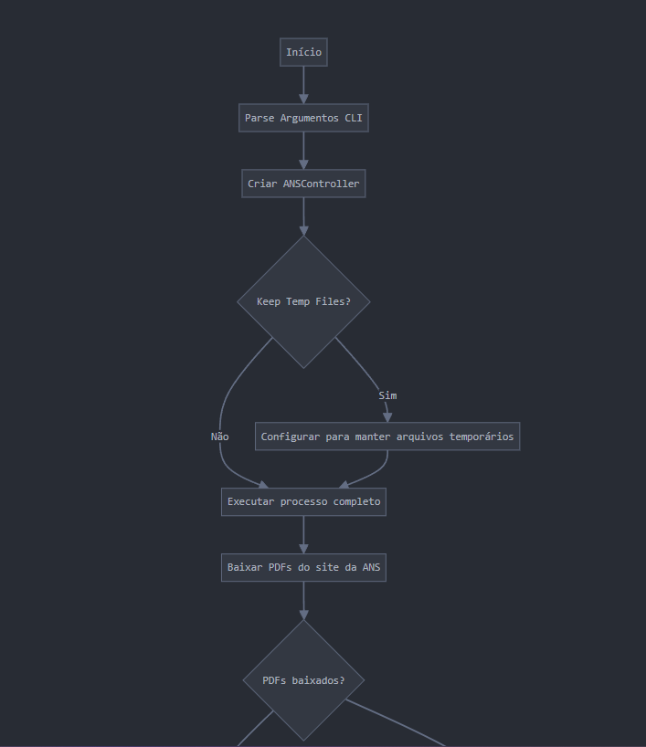
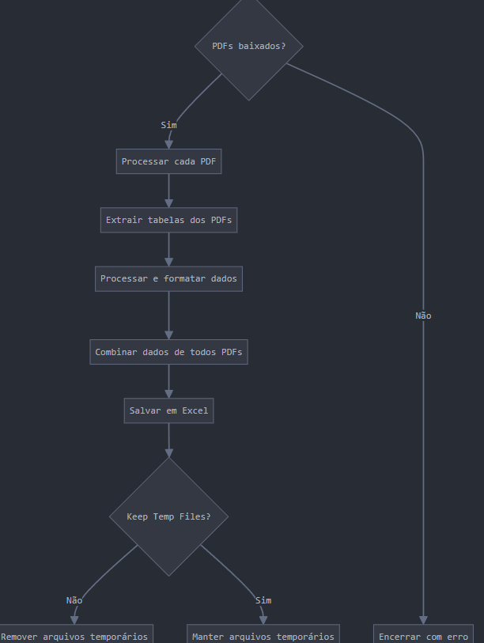
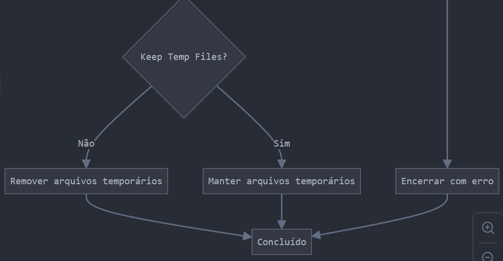
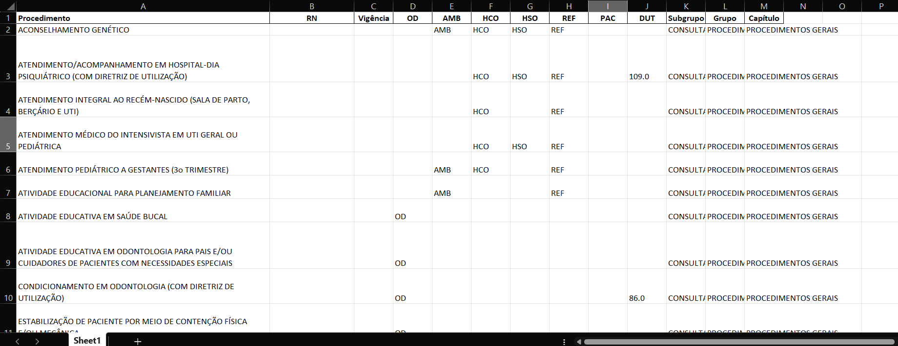

# ANS Scraper e Processador de PDFs

Este projeto faz o scraping de PDFs do site da ANS (Agência Nacional de Saúde Suplementar) e os converte em planilhas Excel formatadas para facilitar a análise de procedimentos de saúde.

## Tecnologias Utilizadas

[](https://www.python.org/)
[](https://requests.readthedocs.io/en/master/)
[](https://www.crummy.com/software/BeautifulSoup/bs4/doc/)
[](https://tabula.technology/)
[](https://pandas.pydata.org/)
[](https://openpyxl.readthedocs.io/en/stable/)
[](https://git-scm.com/)
[](https://www.oracle.com/java/)


## Funcionalidades

1. **Scraping de PDFs**: Baixa automaticamente os PDFs de Anexos I e II da página da ANS
2. **Extração de dados**: Processa os PDFs baixados e extrai tabelas estruturadas
3. **Exportação para Excel**: Organiza os dados em uma planilha Excel padronizada


## Habilidades Desenvolvidas
 - Scraping de dados: Automação para baixar PDFs do site da ANS.

 - Processamento de PDFs: Extração de tabelas com tabula-py e limpeza de dados.

 - Manipulação de arquivos: Download, compactação (ZIP) e remoção de arquivos temporários.

 - Desenvolvimento em Python: Uso de bibliotecas como pandas, tabula-py e openpyxl.

 - Criação de interface de linha de comando: Implementação de opções de execução e configuração do programa.


---

## Fluxo de Execução

O fluxo de execução do programa segue estes passos:

1. **Inicialização**: Leitura dos argumentos da linha de comando
2. **Download**: Obtenção dos PDFs do site da ANS
   - Estabelece conexão com o site da ANS
   - Identifica links para os Anexos I e II
   - Baixa os PDFs para uma pasta temporária
   - Compacta os PDFs em um arquivo ZIP (opcional)
3. **Processamento**: Para cada PDF baixado
   - Extrai tabelas usando tabula-py
   - Limpa e formata os dados 
   - Padroniza os nomes das colunas
4. **Consolidação**: Combina dados de múltiplos PDFs
5. **Exportação**: Salva os dados em Excel formatado
6. **Limpeza**: Remove arquivos temporários (opcional)





---

## Requisitos

- Python 3.7+
- Pacotes Python listados em `requirements.txt`
- Java Runtime Environment (necessário para tabula-py)

## Instalação

1. Clone o repositório:
```bash
git clone https://github.com/seu-usuario/ans-scraper.git
cd ans-scraper
```

2. Instale as dependências:
```bash
pip install -r requirements.txt
```

## Uso

Execute o programa principal:
```bash
python main.py
```

### Opções

- `--keep-temp`: Mantém os arquivos PDF temporários após o processamento
```bash
python main.py --keep-temp
```

---

## Arquivos Gerados

- `anexos.zip`: Arquivo ZIP contendo os PDFs baixados
- `procedimentos_saude.xlsx`: Planilha Excel contendo os dados processados
- `temp_pdfs/`: Diretório temporário (removido após processamento por padrão)

---

## Saída do Excel

Abaixo está um exemplo de como a tabela Excel é organizada após o processamento:



---


## Contribuição

1. Faça o fork do projeto
2. Crie uma branch para sua feature (`git checkout -b feature/nova-feature`)
3. Commit suas mudanças (`git commit -m 'Adiciona nova feature'`)
4. Push para a branch (`git push origin feature/nova-feature`)
5. Abra um Pull Request